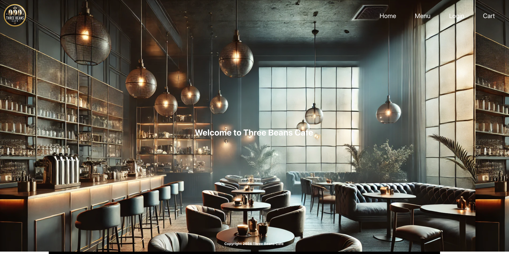
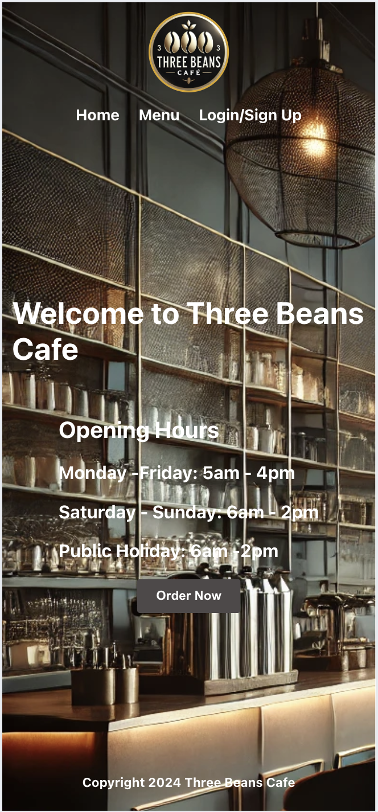

Home - first implemented

## Frontend page plannint

### Home Page

    - Nav bar
    - Show welcome messages
    - Button to order online
    - Footer
        - info address ?
        - open hour ?

### Menu Page

    - Menu Items
        - Menu Item
        - Menu Item model to display with options
    - View Items
    - Some add on like sugar, milk choice
    - Item that can add to Cart
    - Item that can save to My Favourite List
    - Item that can unsave to My Favoirite List
    - button to check out

### Cart Page

    - Show the Cart Items (Cart should save the item in local storage)
    - Change the Item quantity
    - Remove the Item
    - Checkout (Clear the Cart local storage)
    - Show current order status with QR code

### Login/Sign up

    - Email
    - Password

    if not register then have a button to allow user to sign up
    - Username
    - Login Email
    - Password

### User profile

    - Order History
        - List of History
            - show the order time
            - items
            - quantity
            - stauts

    - My Favourite Page
        - Show the save Favourite List Items
        - Remove the save Favourite List Items
        - Add the Favourite List Items to the Cart
        - Button to direct to checkout page

### Admin Login

    - Admin login email:
    - Password

### Office

    - Menu
        - Create new category
        - Update exsting category
        - Delete exstine category
    - Item
        - Create New Item
        - Update exsting item
        - Delete new Item
    - Order
        - View all the orders
        - View individual order
            - Order status
                - Update order status

