# T3A2 - Part B MERN Full-Stack App

## Team Members:

- Esther Faith Dennis
- Brett Russell
- Nicholas Rowe

# Three Beans Cafe website

**Deployed Website Address:** `https://3beanscafe.com`

[Link to live website](https://3beanscafe.com)

# Git repo ( include - frontend, backend, app-documentations)

**Three Beans App Repositories:** [Link to git](https://github.com/orgs/Three-Beans-App/repositories)

**Three Beans App Frontend:** [Link to git](https://github.com/Three-Beans-App/frontend)

**Three Beans App Backend:** [Link to git](https://github.com/Three-Beans-App/backend)

**Three Beans App Documentations:** [Link to git](https://github.com/Three-Beans-App/app-documentations)

# General Documentation

### User Login for Testing - Admin user

This is a default admin account that can be used for testing admin features.

Admin Email: 3bc@email.com  
Password: 12345

### User Login for Testing - Standard user

For testing as a standard user, you can create a new user by signing up in the app.

## Frontend Libraries Used (NPM Packages)

- React
  - React - Use react and react hook to build the app.
  - react-router-dom - For routing and navigation between the application.
  - react-qr-code - To generate the qr code when user submits their order.
  - react-scripts - This is a tool that is provide by react which allows you to run the app with the scripts such as start, build, test.  
- Axios - Use for making HTTP request from frontend to backend API.
- Meterial-UI Icons - use icon for cart, star, x - for close popup etc.
  - @mui/icons-material - This is the main package for Material - UI which provides design guidelines such as pre-built and customize UI components. It must be used with @emotion/react and @emotion/styled.
  - @mui/material - This package also comes with Material UI which mainly contains icons.
  - @emotion/react - This package also comes with Material UI, it is the main package for writing css style in JS.  
  - @emotion/styled - This package also comes with Material UI, it is for creating style components. 
- @testing-library/react - This package is for react testing. It is the main library for tesing the react components and interacting with them.
- @testing-library/jest-dom - This library provide some custom matchers for Jest. This is used by Jest in our project. 
- dotenv - This is for storing the sensitive data variables from the `.env` file and then uses `process.env` to pass the data as key value pairs. I used this for store development address of the server, when developing we pass the api url to it. Then I can use the same key on the deployed server to set the api url in the frontend deployment. 
- web-vitals - This come from react app, mainly for scaling the content performance and interactive stability to ensure a good user experience. 

### App Images

- Logo - Generate by AI.
- Background - Generate by AI.
- Menu Images - Online images.

## Project Management

For the project management we continue useing

- Trello - We divide our project tasks, and kept tracking, moving, and reviewing tickets as we go.
- Discord - We communicated about our project through discord, regularly updating teammates and asking for help if needed, post some screenshots, ask teammates advice and organized meetings and so on.
- Zoom - We held zoom meetings every week to talk about the project, and see how everyone was going.

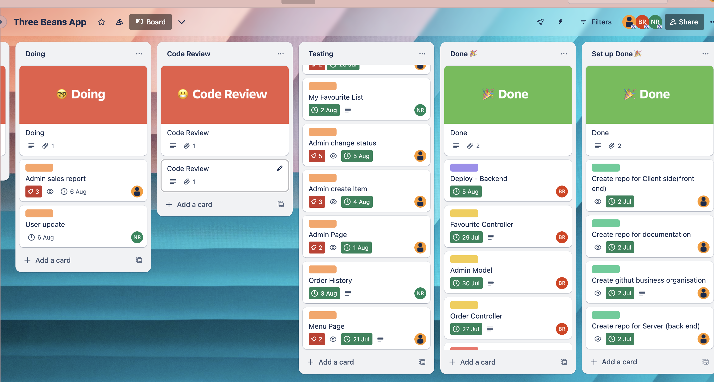

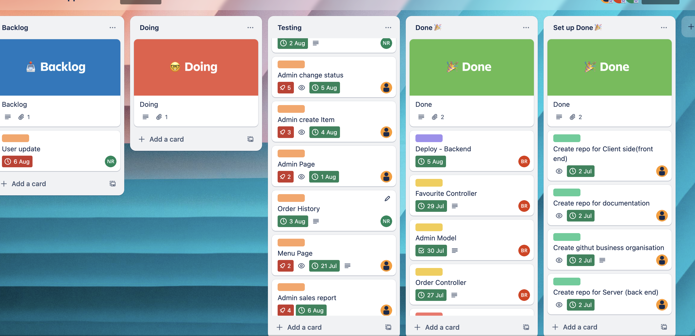

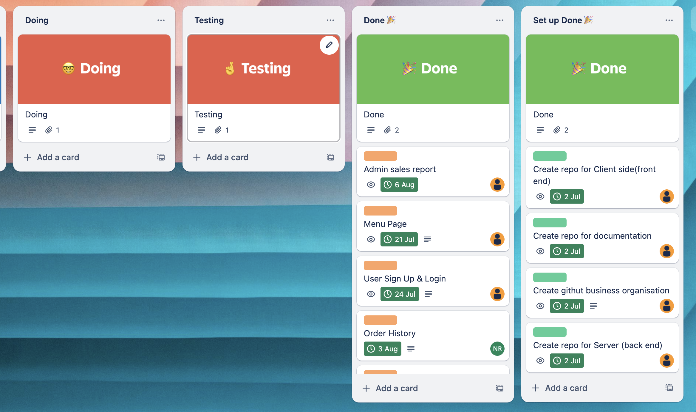

# Control Flow

We used feature branchs to develop our code, and merge code back into the main branch using pull requests.

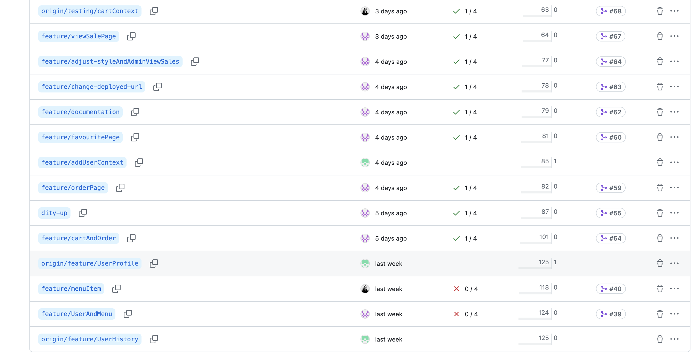

# App Sceenshorts

## Home page - without user login

## Home page - with user login

## Home page - with user login

## Menu Page - with user login

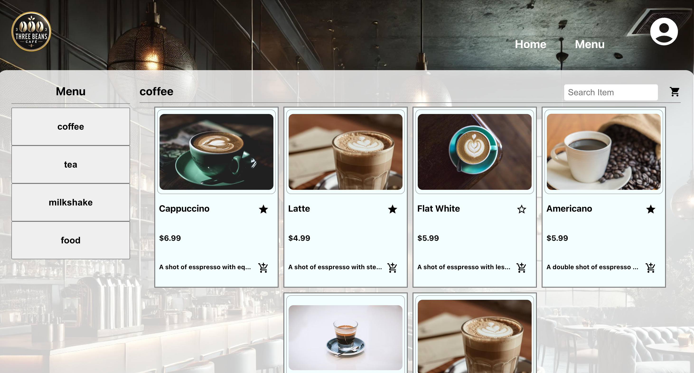

## Cart Page - with user login

## Confirm Page - with user login

## Confirm Page - without user login

## Order Page - with user login

## Order Page - with user login

## History Page - must with user login

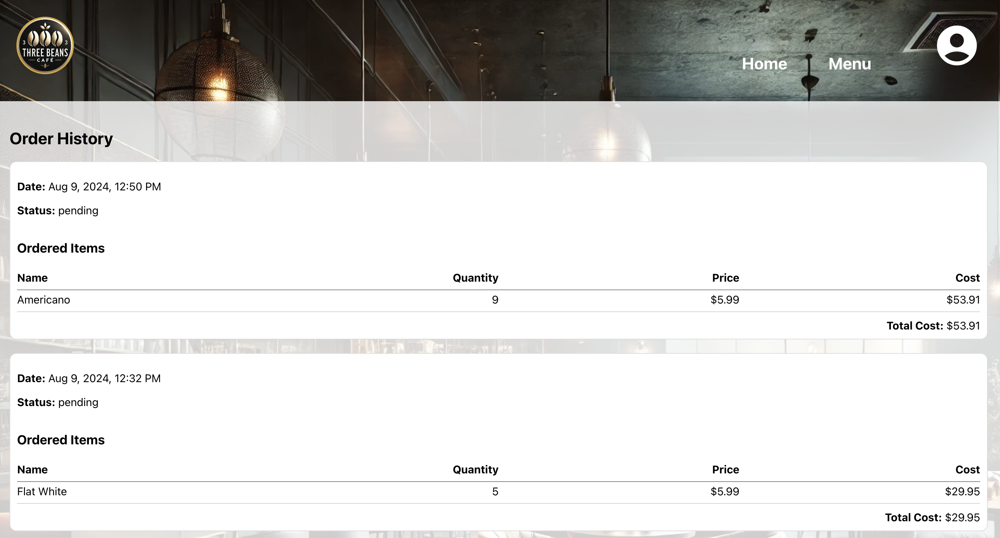

## Favourite Page - must with user login

## Admin Page

## Admin Add New Item Page

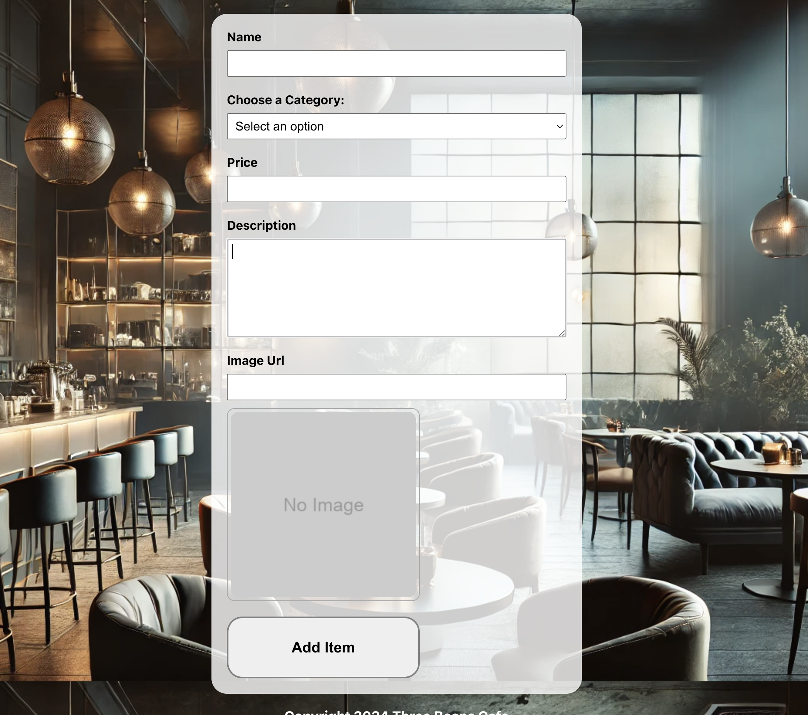

## Admin Menu Page (Item With Update Icon)

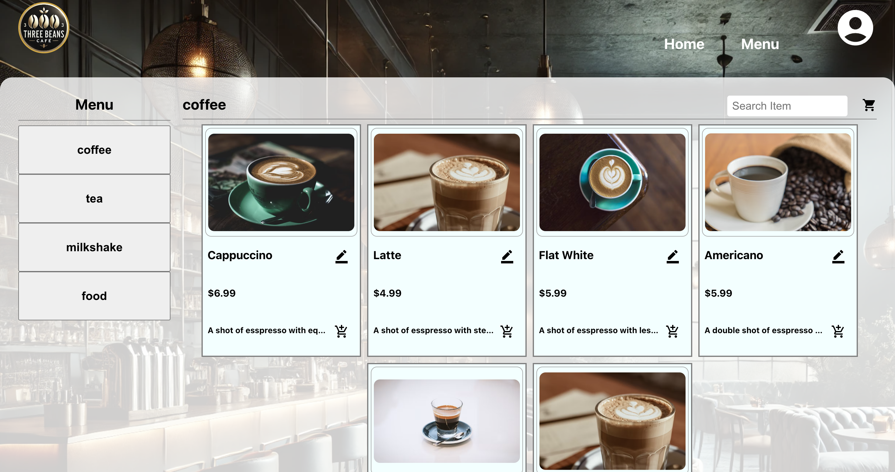

## Admin Update and Delete Existing Item Page

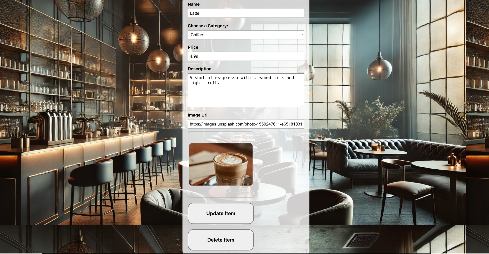

## Admin View All Orders Page

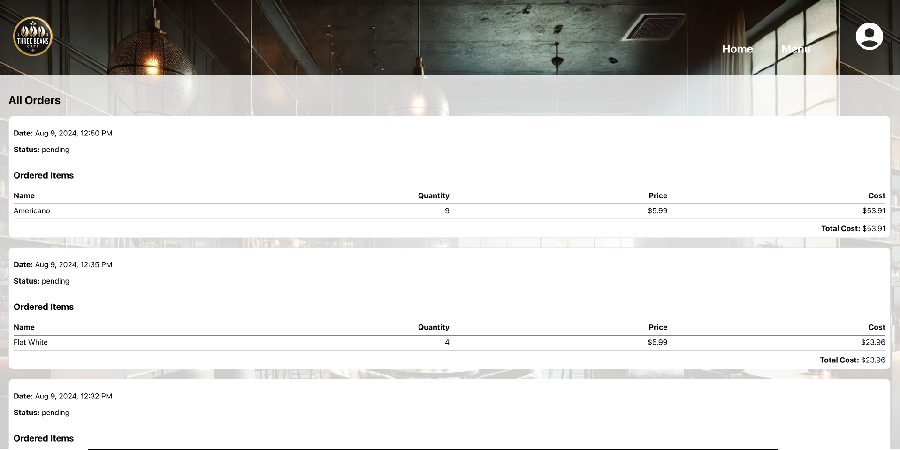

## Admin View All Active Orders Page

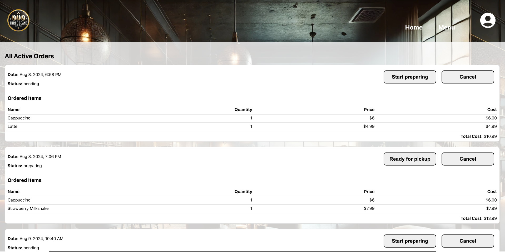

## Admin View Sales Report

# Manual Test

## Development Test

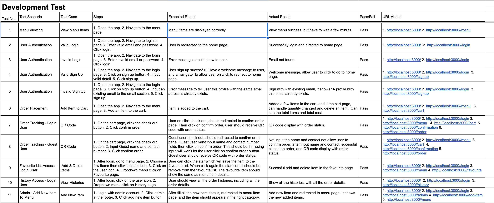
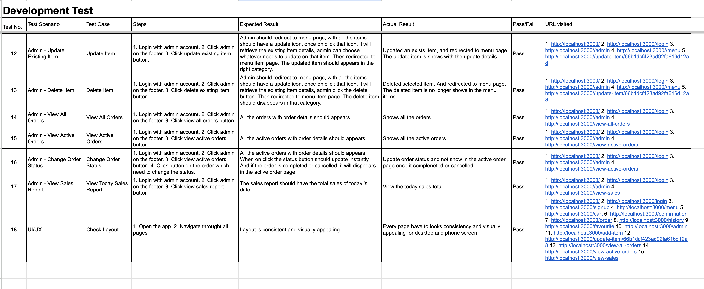

## Production Test

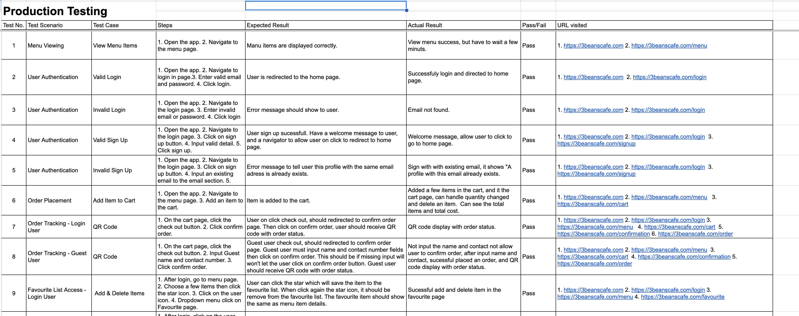
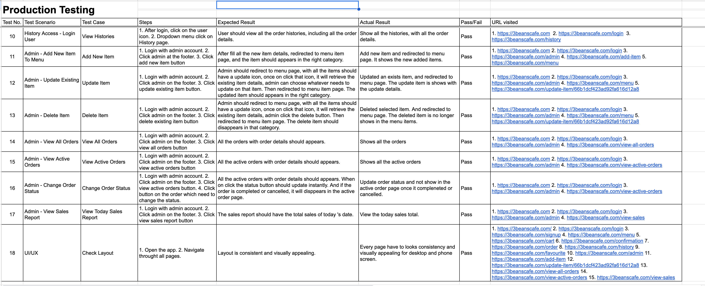
